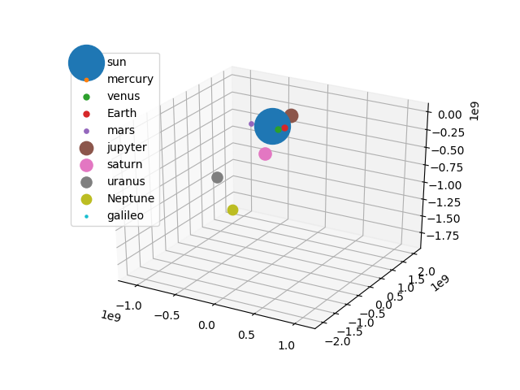

# Mission-Galileo
Galileo probe launch simulation using C and MPI.

## Introduction
Galileo was an American uncrewed spacecraft that studied the planet Jupiter and its moons. it consisted of an orbiter and an entry probe. It was delivered into Earth orbit on October 18, 1989 by Space Shuttle Atlantis. Galileo arrived at Jupiter on December 7, 1995, and became the first spacecraft to orbit Jupiter.

I will recreate the Galileo path of launch, The coordinates will be heliocentric following ephemeris of the lauch day. (The ephemeris are available in [JPL's HORIZONS](https://ssd.jpl.nasa.gov/horizons.cgi)).

## Initial Conditions
the following table contains the initial conditions for the solar system, the units for distance will be given in AU (Astronomical Units, 149,597,870,700 m) and the units for velocity will be given in AU per day.

| Body | Mass (KG) | X | Y | Z | Vx | Vy | Vz |
| --- | --- | --- | --- |--- |---|---|---|
| Galileo | 2223 | 8.908428789496743e-1 | 4.460649134874483e-1 | 1.441885322941325e-3 | 6.598375451449180e-3 | 1.378781163270632e-2 | 1.238600174019397e-3 | 
| Sun | 1.989e30 | 0 | 0 | 0 | 0 | 0 | 0 | 
| Mercury | 3.302e23 | -2.423837340508285e-1 | 2.283179366193356e-1 | 4.090147930328242e-2 | -2.500533582231846e-2 | -1.933534335040159e-2 | 7.165606201190990e-4 | 
| Venus | 48.685e23 | 6.279965351339432e-1 | -3.659074113502193e-1 | -4.124507417057483e-2 | 1.006223611787707e-2 | 1.739227435714184e-2 | -3.437549474002681e-4 |
| Earth | 5.97219e24 | 9.048814763968241e-1 | 4.168743201018727e-1 | 1.080349655773159e-5 | -7.472367882942215e-3 | 1.555856623260806e-2 | 4.788602272729372e-7 |
| Mars |  6.4171e23 | -1.572843746193111 | -4.215405696821336e-1 | 2.986243952490811e-2 | 4.148243175162371e-3 | -1.232197647750978e-2 | -3.601215923958582e-4 |
| Mercury | 3.302e23 | -2.423837340508285e-1 | 2.283179366193356e-1 | 4.090147930328242e-2 | -2.500533582231846e-2 | -1.933534335040159e-2 | 7.165606201190990e-4 | 
| Jupyter | 1898.13e24 | 5.523818468809624e-3 | 5.124075547305725 | -2.132930486986605e-2 | -7.650493216941010e-3 | 3.591116688691631e-4 | 1.698233530987749e-4 | 
| Saturn | 5.6834e26 | 2.426782948714540 | -9.733922843102670 | 7.326795987290702e-2 | 5.106080342974652e-3 | 1.334845188513565e-3 | -2.266378604457396e-4 |
| Uranus | 86.813e24 | 1.623038180331797 | -1.929828307633671e1 | -9.266636267812192e-2 | 3.884247099415706e-3 | 1.474794321989732e-4 | -4.974092991353999e-5 |
| Neptune | 102.413e24 | 6.164462103795938 | -2.957298645388243e1 | 4.669463041113271e-1 | 3.047705175550985e-3 | 6.585262491739477e-4 | -8.416363874946226e-5 |

## Required dependencies
* OpenMPI `sudo apt-get install -y openmpi-bin`

* Python 3 (for 3D plotting purposes)

* Matplotlip   `pip install matplotlib`

* Imageio `pip install imageioc`

## Compilation and execution
1. Download or clone the repository `git clone https://github.com/nek400/Mission-Galileo.git`

2. Open a terminal in the folder that contains the files.

3. Compile files using GNUMakefile file by the following command `make` this will return a executable file named "main".

4. Use the command `mpiexec -n 'number of process' ./main > output.dat` this will generate a file that contains all calculations.

5. Execute the python 3 plotter using `python3 view3D.py` the results will be contained in a folder called "Data"

## Results
The results given by "view3D.py" using the data in "output.dat" is a Gif animation of the Galileo path of launch.

